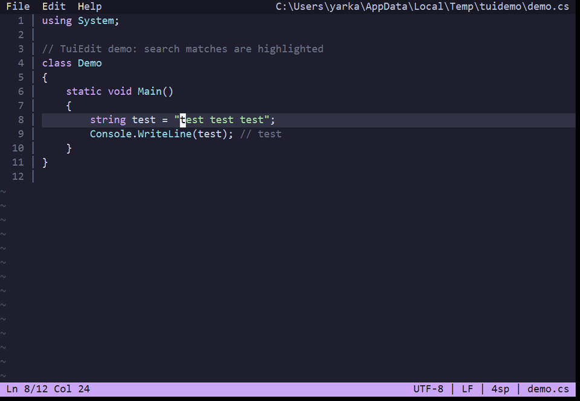
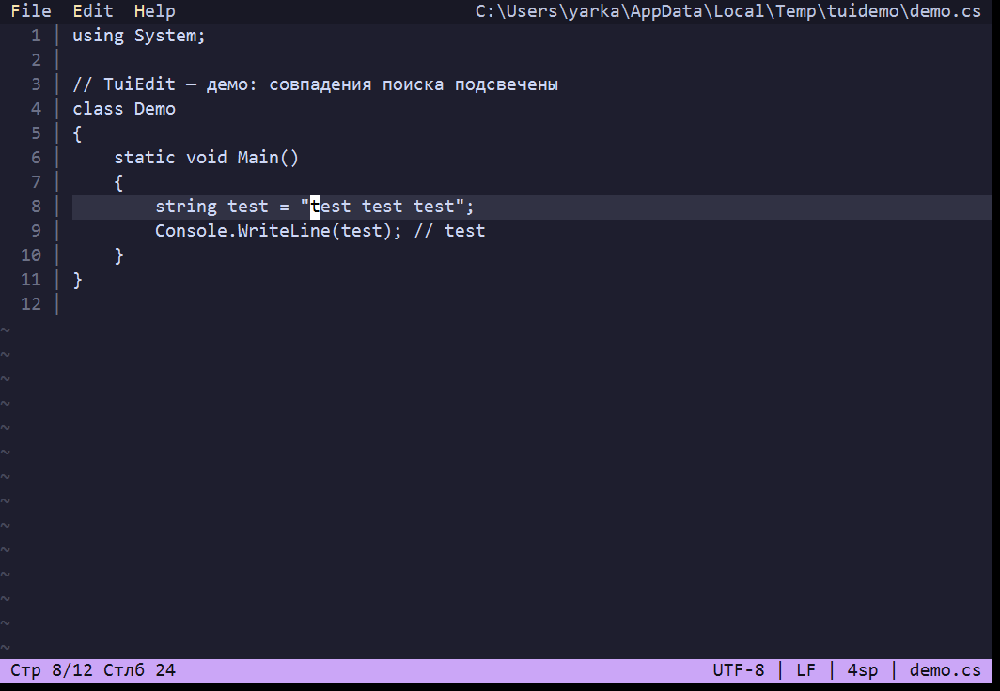
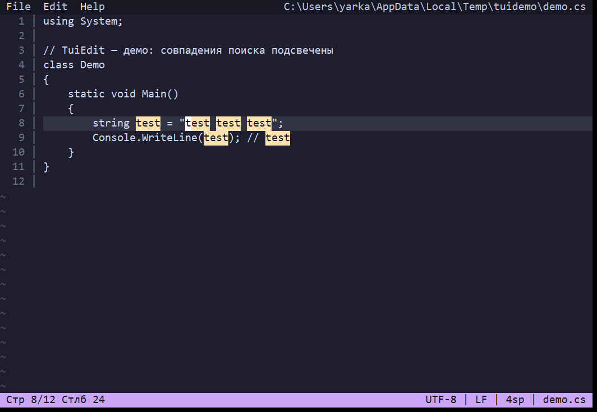
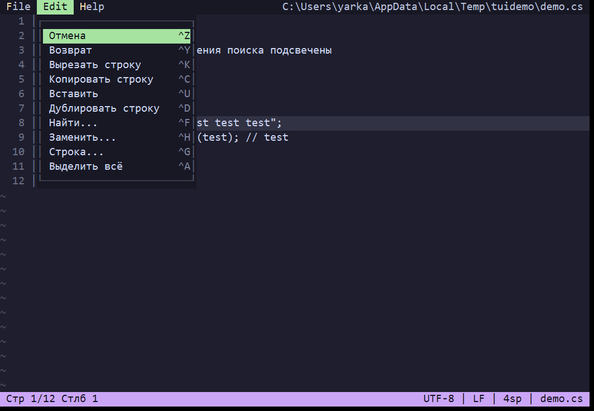
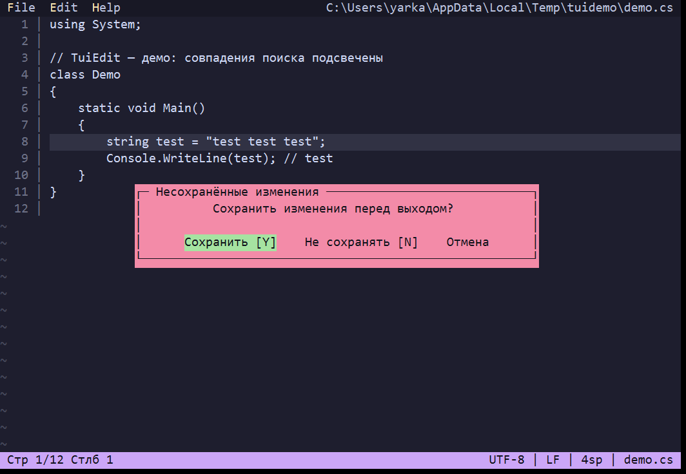
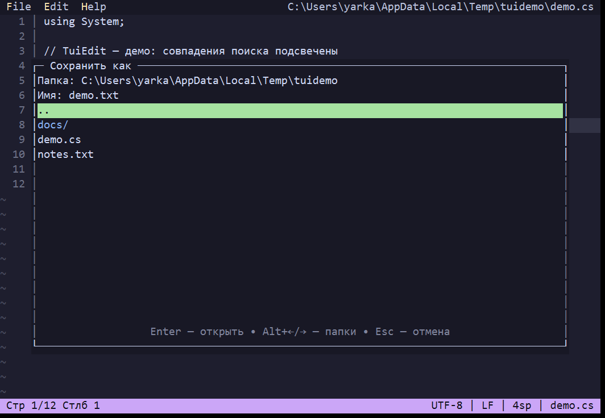
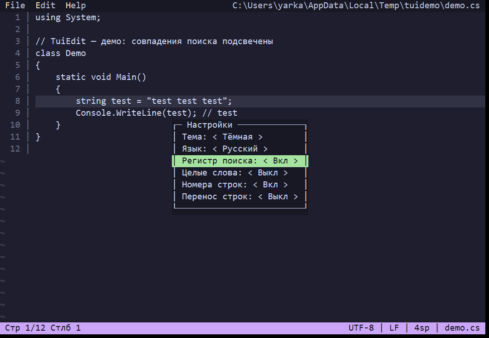
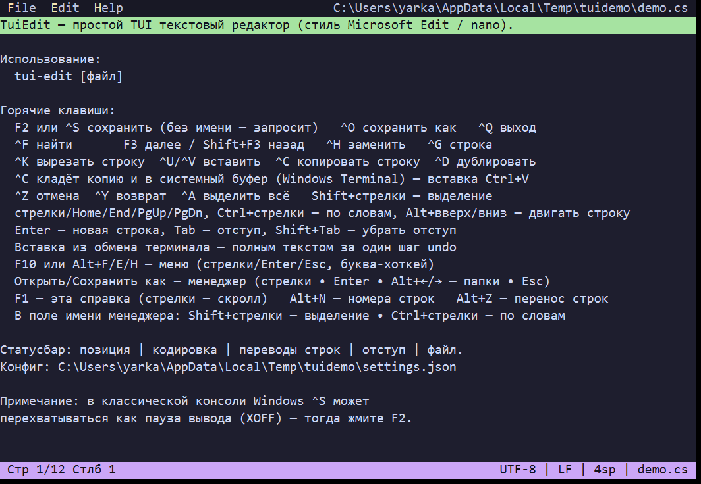

# TuiEdit

Простой TUI текстовый редактор в стиле Microsoft Edit / nano.
Чистый `System.Console`, без сторонних библиотек. .NET 10.

## Возможности

- Редактирование: undo/redo (посимвольно и блоками), выделение `Shift+стрелки`, вырезать/копировать/вставить строку (`^K`, `^C`, `^U`/`^V`), дублирование (`^D`), движение строк (`Alt+↑/↓`), удаление/движение по словам.
- Поиск (`^F`, `F3`/`Shift+F3`): оборот с начала, счётчик `k/N`, опции «регистр» и «целые слова». Мгновенная замена всего документа (`^H`) за один шаг undo.
- Файловый менеджер для Открыть/Сохранить как: диски, `..`, подсветка файлов, подтверждение перезаписи отдельным окном. В поле имени — выделение (`Shift`), движение по словам (`Ctrl+стрелки`), навигация `Alt+←/→`.
- Сохранение формата: кодировка (UTF-8/BOM/UTF-16), переводы строк (CRLF/LF/CR) и отступ определяются при открытии и сохраняются при записи.
- Темы `dark`/`light`, языки `ru`/`en`, номера строк (`Alt+N`), мягкий перенос (`Alt+Z`), экран справки (`F1`).
- Системный буфер обмена через OSC52 (Windows Terminal): `^C` кладёт копию, вставка — `Ctrl+V`.

## Горячие клавиши

```text
F2 или ^S сохранить (без имени — запросит)   ^O сохранить как   ^Q выход
^F найти       F3 далее / Shift+F3 назад   ^H заменить   ^G перейти к строке
^K вырезать строку  ^U/^V вставить  ^C копировать строку  ^D дублировать
^C кладёт копию и в системный буфер (Windows Terminal) — вставка Ctrl+V
^Z отмена  ^Y возврат  ^A выделить всё   Shift+стрелки — выделение
стрелки/Home/End/PgUp/PgDn, Ctrl+стрелки — по словам, Alt+вверх/вниз — двигать строку
Enter — новая строка, Tab — отступ, Shift+Tab — убрать отступ
F10 или Alt+F/E/H — меню (стрелки/Enter/Esc, буква-хоткей)
F1 — справка   Alt+N — номера строк   Alt+Z — перенос строк
```

Полный список: `tui-edit --help` или `F1` в редакторе.

## Скриншоты



| Редактор | Поиск | Меню |
|---|---|---|
|  |  |  |

| Модалка | Менеджер | Настройки |
|---|---|---|
|  |  |  |



## Сборка и запуск

```powershell
dotnet run                          # Debug-запуск
dotnet build -c Release              # сборка в bin/Release/net10.0/
tui-edit [файл]                     # открыть файл (или пустой документ)
tui-edit --help | --version
```

> Если exe занят запущенным редактором (`MSB3026`) — закройте его (`^Q`) и соберите заново.

## Конфиг

`settings.json` рядом с exe (portable-режим), иначе `%APPDATA%\TuiEdit\settings.json`:

```json
{
  "Theme": "dark",
  "Language": "ru",
  "SearchMatchCase": true,
  "SearchWholeWord": false,
  "ShowLineNumbers": true,
  "WordWrap": false
}
```

Меняется из диалога настроек в меню File, применяется и сохраняется сразу.

## Структура

```text
Program.cs            вход, --help/--version, запуск редактора
Core/TextBuffer.cs    буфер: строки, undo/redo, поиск/замена, кодировки
Core/WordMotion.cs    движение по словам (как в VS Code)
Core/TabStops.cs      табы + WordWrap (сегменты мягкого переноса)
Core/EditorCommand.cs команды редактора
Input/KeyMap.cs       клавиши → команды
Input/InputReader.cs  ввод + bracketed paste
Ui/TuiEditor.cs       движок: рендер, меню, диалоги, менеджер
Ui/Screen.cs          diff-буфер кадра (без мигания)
Ui/FilePicker.cs      файловый менеджер (чистая модель)
Ui/Modal.cs           модальные попапы (чистая модель)
Ui/SettingsDialog.cs  состояние диалога настроек
Config/               AppSettings + SettingsStore (JSON)
Resources/            strings.ru/en.json (паритет ключей обязателен)
```
