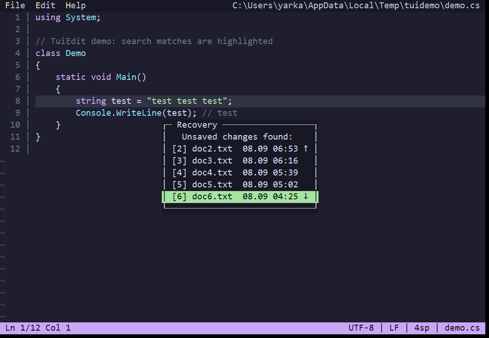
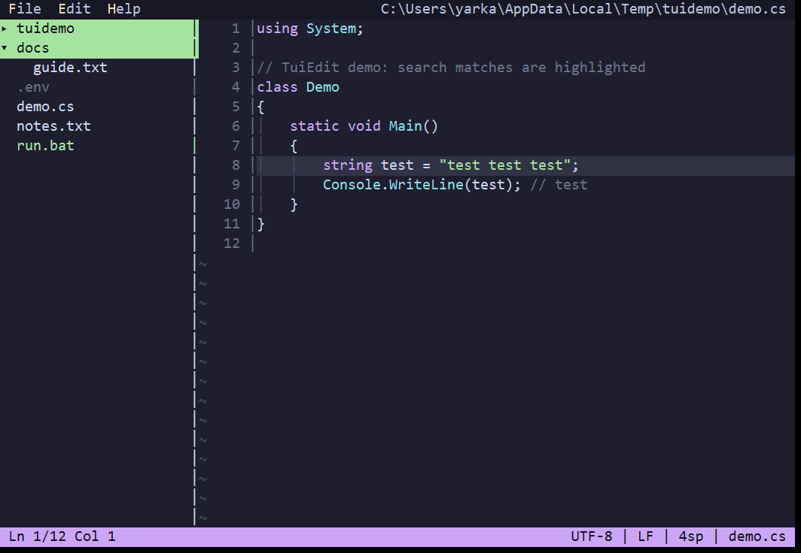
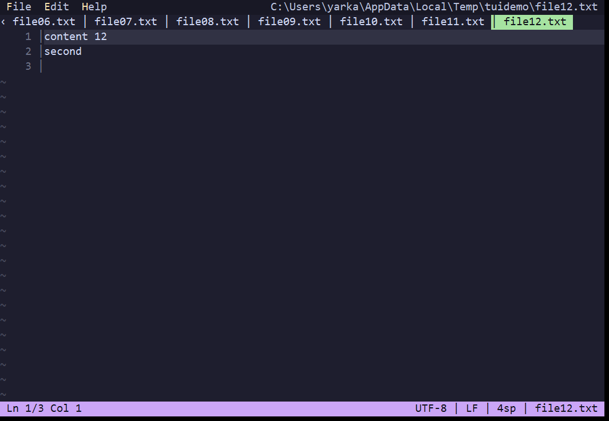
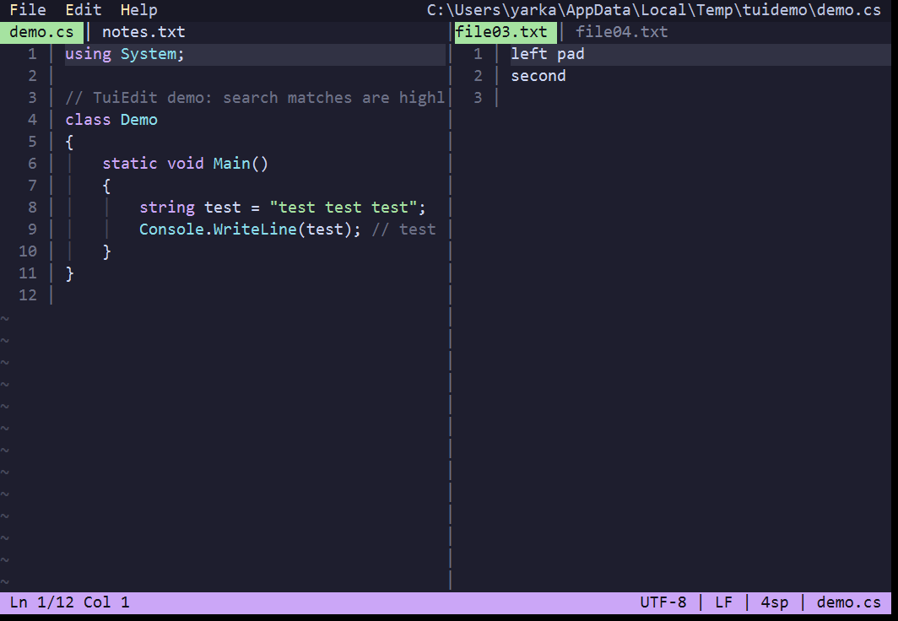
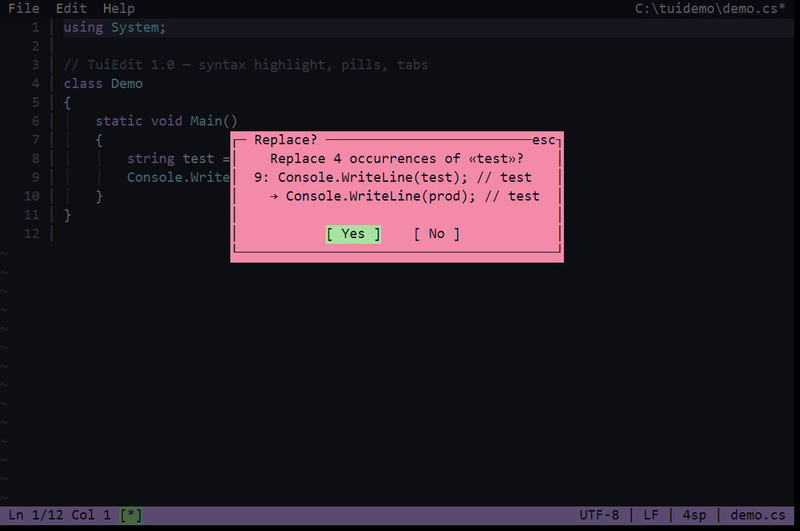
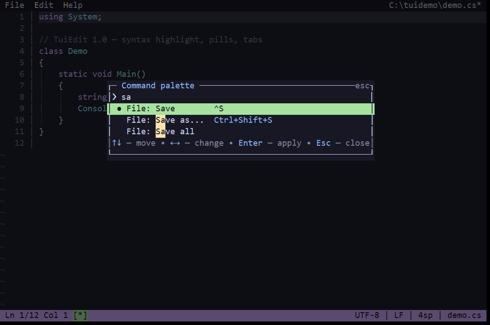
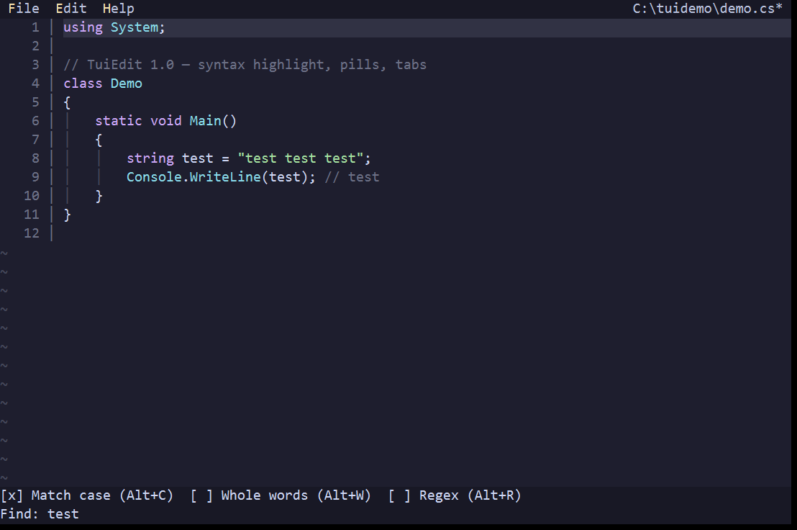
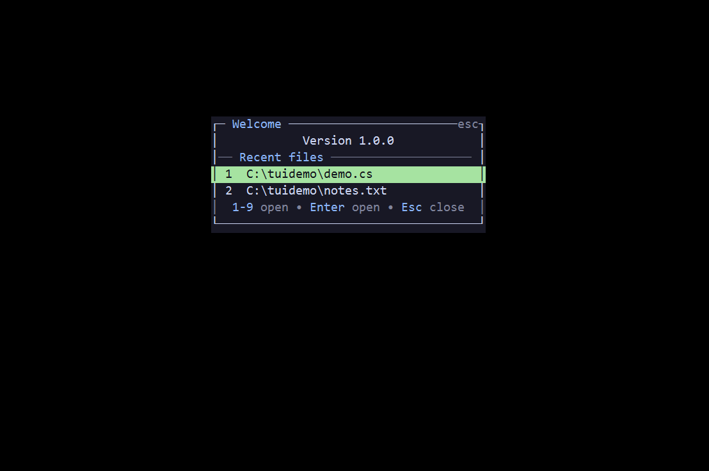
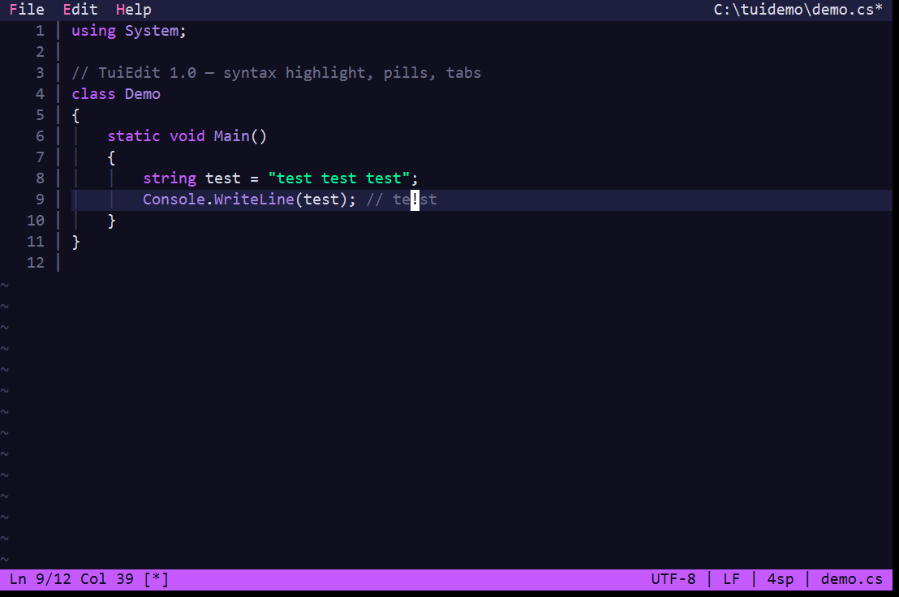

# TuiEdit

**The terminal editor that actually works on Windows.** Fast, keyboard-first, zero dependencies, one exe.
No plugin zoo, no 46-second LSP startup — open and edit.

- ✅ **Paste works in Windows Terminal** — bracketed paste lands as one block in a single undo step (micro/helix still paste char-by-char there — see their issues [#4037](https://github.com/micro-editor/micro/issues/4037), [#15647](https://github.com/helix-editor/helix/issues/15647))
- ✅ **Single 0.5 MB exe** (Windows / Linux / macOS arm64 in every release — download, unzip, run; requires the free [.NET 10 Runtime](https://dotnet.microsoft.com/download/dotnet/10.0))
- ✅ **Multicursor, splits, tabs, file tree, grep, git gutter** — out of the box, no config needed
- ✅ **Portable settings** — `settings.json` next to the exe; keybindings, themes, grammars are plain JSON you can edit

## Install (30 seconds)

Download `tui-edit-*-win-x64.zip` (Windows), `-linux-x64` or `-osx-arm64` from
[Releases](https://github.com/Nerwe/TuiEdit/releases), unzip, run `tui-edit`:

```powershell
tui-edit notes.txt       # open a file
tui-edit main.cs:120     # open at line 120
```

Or build from source (requires .NET 10 SDK): `dotnet run`.

## Features

A fast keyboard-first TUI text editor.
Pure `System.Console`, no third-party libraries. .NET 10.

See [CHANGELOG.md](CHANGELOG.md) for release history.

- Editing: undo/redo (per keystroke and per block) plus time travel (`F12`: `earlier`/`later` by steps or `5m`/`30s`), `Shift+arrows` selection, cut/copy/paste line (`^K`, `^C`, `^U`/`^V`), duplicate (`^D`), toggle line comment (`Ctrl+/`), matching-bracket highlight and jump (`Alt+]`), move lines (`Alt+↑/↓`), word-wise delete/move, trim trailing whitespace, sort lines, auto-pairs for brackets/quotes (toggle in Settings).
- More editing power: surround with any pair (`^L` add, `Alt+L` change, `Alt+J` delete), light registers (`^X` then `a-z`/`0-9`), filter selection through any shell command (`^R`, e.g. `sort`, `jq`), jumplist back/forward (`Alt+←/→`).
- Find (`^F`, `F3`/`Shift+F3`): live highlight while typing, wrap-around, `k/N` counter, match case / whole words / regex toggles right in the prompt (`Alt+C/W/R`). Instant whole-document replace (`^H`) in a single undo step, with confirmation past 50 matches showing a before/after preview of the first hit. Grep across files (`Ctrl+Shift+F`) with jump-to-hit.
- Syntax highlighting from JSON grammars (C#, Python, JavaScript/TypeScript, JSON, Markdown, PowerShell, XML, INI built in). On first run the grammars are extracted to the `grammars` folder next to `settings.json` — edit them to customize, drop in your own.
- File manager for Open/Save as: drives, `..`, file highlight with sizes, overwrite confirmation in a separate window. `F7` new folder, `F2` rename, `F8` delete (with confirmation, recursive), `Ctrl+H` hidden files. Name field and Find/Replace/GoTo prompts share one line editor: selection (`Shift`), word-wise motion (`Ctrl+arrows`), word delete (`Ctrl+BS/Del`), `Alt+←/→` navigation in the manager.
- Format preservation: encoding (UTF-8/BOM/UTF-16), line endings (CRLF/LF/CR) and indent are detected on open and kept on save; all three are switched in the File format dialog (`F9`, shown in the status bar). Read-only files are flagged `[read-only]` and refuse to save.
- Five built-in themes (`dark`, `light`, `3024 Night`, `Paper`, `Posting`) plus your own schemes, `en`/`ru` languages, line numbers (`Alt+N`), word wrap (`Alt+Z`), indent guides, whitespace marks (`Alt+.`), ruler column, git diff gutter, help screen (`F1`). The status bar layout is customizable (`StatusFormatLeft/Right` with `$(...)` verbs) and states render as pills (`[*]`, `[read-only]`).
- Bookmarks (`F2` toggle, `Shift+F2` next, gutter `●`), indent folding (`Alt+-`), buffer-word completion (`Ctrl+Space`), document stats (`F4`).
- Multicursor: `Alt+Shift+↑/↓` adds a caret above/below, `Alt+D` adds the next occurrence of the word under the caret, `Esc` clears. Typing, Backspace/Delete, Enter and Tab apply at every caret in a single undo step; arrows/Home/End move all carets.
- Go to definition (`Alt+G`, textual, no language server): jumps to `class|def|function NAME`, `NAME(` or `NAME =` in the current file first, then the project; `Alt+Left` jumps back.
- Change review (`Alt+R`): lists every changed hunk in the repo (handy after an AI agent edits); pick one to jump to it, `Alt+Left` jumps back.
- Optional session restore: reopen the previous tabs with cursor positions when started without arguments (off by default, toggle in Settings); dirty untitled tabs round-trip with their content.
- File tree (`Ctrl+B`): fixed-width sidebar with an expandable folder tree (`Enter`/`←`/`→`), git change marks (folders aggregate), `Enter` opens files, `Esc` back to text. Walking the tree previews files in a single tab (same tab is reused; `Enter` pins it, edits pin it automatically). `F7` new file/folder, `F2` rename, `Del` delete with two-step confirm. Entries are color-coded: dirs, hidden and executables.
- Tabs: open tab bar (`Ctrl+T` new, `Ctrl+W` close, `Ctrl+PgDn/PgUp` switch, `Alt+1..9,0` jump, `Ctrl+P` list); long rows scroll with the active tab always visible; dirty tabs ask on close, quitting walks through them one by one. Quick-open files by name across the project (`Alt+O`, `ft:cs` filters by extension), command line (`F12`: `set` incl. `encoding`/`ending`/`indent`, `goto`, `find`, `earlier`, `later`, `save`, `quit`) with history (`Up`/`Down`) and completion (`Tab`).
- Startup dashboard with recent files (`1-9`/`Enter` to open, any key types through).
- Split view (`Alt+S`): two or more panes side by side, each with its own tabs; `F6`/`Shift+F6` or `Ctrl+1..9` move focus (tab keys act on the focused pane).
- System clipboard via OSC52 (Windows Terminal) with fallback to native tools (`clip`, `pbcopy`, `wl-copy`/`xclip`/`xsel`): `^C` copies, paste with `Ctrl+V`.

## Hotkeys

```text
^S save (asks for name if new)   Ctrl+Shift+S save as   ^Q quit   ^N new
File menu — Save all, File format (`F9`)
^F find       F3 next / Shift+F3 prev   ^H replace   ^G go to line   Ctrl+Shift+F grep
  (in Find: Alt+C match case, Alt+W whole words, Alt+R regex)
^K cut line  ^U/^V paste  ^C copy line  ^D duplicate
Ctrl+/ toggle line comment  Alt+] matching bracket
^R filter through shell  ^L surround  Alt+L change surround  Alt+J unwrap
^X register, then yank/paste  Alt+Left/Right — jumplist back/forward
^C also puts the copy into the system clipboard (Windows Terminal) — paste with Ctrl+V
^Z undo  ^Y redo  ^A select all   Shift+arrows — selection
arrows/Home/End/PgUp/PgDn, Ctrl+arrows — by word, Ctrl+BS/Del — delete word, Ctrl+E/Home/End — doc start/end, Alt+up/down — move line
Enter — new line, Tab — indent, Shift+Tab — unindent
F10 or Alt+F/E/H — menu (arrows/Enter/Esc, letter hotkey)
F1 — help   Alt+N — line numbers   Alt+Z — word wrap   Ctrl+B — file tree (arrows/Enter, F7 new, F2 rename, Del delete)
F9 — file format (encoding / line endings)   F4 — document stats   F5 — command palette (commands, menus, settings search)   F12 — command line
F2 — bookmark   Shift+F2 — next bookmark   Alt+- — fold   Ctrl+Space — complete
Alt+Shift+Up/Down — add caret   Alt+D — caret at next occurrence   Esc — clear carets/selection
Alt+G — go to definition (Alt+Left — back)   Alt+R — review changes
Ctrl+PgDn — next tab   Ctrl+PgUp — prev (Ctrl+Tab / Ctrl+Shift+Tab where the terminal passes them)
Ctrl+T — new tab   Ctrl+W — close tab
Alt+1..9,0 — jump to tab   Ctrl+P — tab list   Alt+O — quick open
```

Full list: `tui-edit --help` or `F1` in the editor.

## Screenshots


| Editor | Find | Menu |
|---|---|---|
|  |  |  |

| Modal | Manager | Settings |
|---|---|---|
|  |  |  |

| Recovery | Panel |
|---|---|
|  |  |

| Tabs | Split |
|---|---|
|  |  |

| Replace | Palette | Prompt |
|---|---|---|
|  |  |  |

| Dashboard | Help |
|---|---|
|  |  |

## Themes

Five built-ins, switchable in Settings or via `F12`: `set theme <name>`.

| dark | Posting (dark) |
|---|---|
|  |  |

Also `light`, `3024 Night` and `Paper` — plus your own schemes (see [Custom themes](#custom-themes)).

## Build & run

```powershell
dotnet run                          # Debug run
dotnet test                         # xUnit tests (TuiEdit.Tests)
dotnet build -c Release              # build to bin/Release/net10.0/
tui-edit [file]                 # open a file (or an empty document)
tui-edit file:120               # open at line 120 (:$ goes to the end)
tui-edit --help | --version
```

> If the exe is locked by a running editor (`MSB3026`) — quit it (`^Q`) and rebuild.

## Config

`settings.json` next to the exe (portable mode), otherwise `%APPDATA%\TuiEdit\settings.json`:

```json
{
  "Theme": "dark",
  "Language": "en",
  "SearchMatchCase": true,
  "SearchWholeWord": false,
  "ShowLineNumbers": true,
  "ShowIndentGuides": true,
  "WordWrap": false,
  "RestoreSession": false
}
```

Editable from the settings dialog in the File menu, applied and saved immediately.

## Mouse

Off by default (`Mouse` in settings or settings.json): terminals
handle mouse reporting inconsistently, and a flood of motion events used
to starve keyboard input. Levels: `Off` (native terminal selection),
`Basic` (clicks + wheel), `Drag` (button-held motion), `Motion` (all motion).
When on: left-click positions the cursor, drag selects text (copies on
release when `CopyOnSelect` is set, right-click copies a live selection),
wheel scrolls, buttons/menus/dialogs/list rows highlight
on hover and activate on click, wheel scrolls scrollable lists.

## Keybindings

`keybindings.json` next to `settings.json` (a commented example is created
on first run): `"Command": "key"` overrides the default, `null` unbinds it.
Notation is `Ctrl`/`Alt`/`Shift` + key, case-insensitive:

```jsonc
{
  "Save": "Ctrl+Shift+S", // replaces Ctrl+S
  "SaveAll": "Ctrl+T", // commands without a default key become bindable
  "GoToLine": null // Ctrl+G will do nothing
}
```

Key names: letters, digits, `F1`–`F24`, `Up`/`Down`/`Left`/`Right`,
`Home`/`End`, `PageUp`/`PageDown`, `Space`, `Tab`, `Enter`, `Esc`,
punctuation (`.`, `/`, `-`, …) or raw `ConsoleKey` names (`OemPeriod`).
A printable key requires `Ctrl` or `Alt` (bare letters would break typing);
unknown commands and bad entries are ignored. On conflict the later entry
wins. Menu hints follow your bindings automatically. Edited files apply
live without restart.

## Backups

With `BackupOnSave` on, every save keeps a versioned copy of the previous
content in the `backups` folder next to `settings.json` — never next to your
files. Up to 5 recent copies per file are kept, copies older than 7 days are
pruned on startup. Saves are atomic (temp file + rename), so an interrupted
write never leaves a truncated file.

Unsaved work is auto-drafted every 30 seconds; on a crash the editor dumps
all modified tabs to drafts before exiting, and offers them back via
the Recovery dialog on next start. Set `TUIEDIT_DEBUG=1` for a full stack
trace on crash (otherwise only a one-line message is printed).

Files over 16 MB open only after confirmation — highlighting a giant file
can take seconds.

## Custom themes

Like `schemes` in Windows Terminal: add a `Themes` array — each scheme has
a `Name`, a `Base` (`dark`/`light`, defaults to `dark`) and `Colors`
(role → `#rrggbb`). Unset roles come from the base; a name matching
a built-in overrides it. Role names are the `Theme` record fields
(`EditorBg`, `EditorFg`, `CurLineBg`, `SelBg`, `MatchBg`, `StatusBg`,
`ModalBg`, `ButtonSelBg`, `PickerDirFg`, `AccentFg`, `GitAddFg`, `GitModFg`, …). The file tolerates comments,
trailing commas and any key case:

```json
{
  "Theme": "3024 Night",
  "Themes": [
    {
      // only overrides — the rest comes from "dark"
      "Name": "3024 Night",
      "Base": "dark",
      "Colors": {
        "EditorBg": "#090300",
        "EditorFg": "#a5a2a2",
        "CurLineBg": "#4a4543",
        "SelBg": "#4a4543",
        "SelFg": "#a5a2a2",
        "MatchBg": "#cdab53",
        "MatchFg": "#090300",
        "StatusBg": "#a16a94",
        "StatusFg": "#090300",
        "ButtonSelBg": "#01a252",
        "ButtonSelFg": "#090300",
        "PickerDirFg": "#01a0e4",
        "PickerExeFg": "#01a252"
      }
    }
  ]
}
```

Custom names appear in the settings dialog theme row next to the built-ins:
`dark`, `light`, `3024 Night (dark)`, `Paper (light)`
(the bracket says whether the theme is dark or light).

## Syntax grammars

Highlighting rules are JSON plugins (VS Code TextMate-style, simplified).
On first run the built-in grammars are extracted to the `grammars` folder
next to `settings.json` (portable mode: next to the exe) — edit them in
place to customize; any `*.json` you drop there is picked up, matching by
`Name` or `Extensions` overrides a built-in. If the folder is missing or
unreadable, the embedded copies are used as a fallback.
`"Grammar": "auto"` picks by file extension; a language name forces it.

```json
{
  "Name": "C#",
  "Extensions": [".cs"],
  "LineComment": "//",
  "IgnoreCase": false,
  "Rules": [
    { "Scope": "comment", "Begin": "/\\*", "End": "\\*/" },
    { "Scope": "comment", "Match": "//.*$" },
    { "Scope": "string", "Match": "\"(?:\\\\.|[^\"\\\\])*\"?" },
    { "Scope": "keyword", "Match": "\\b(?:if|else|for|while|return)\\b" },
    { "Scope": "number", "Match": "\\b\\d[\\d_]*(?:\\.\\d+)?\\b" },
    { "Scope": "type", "Match": "\\b[A-Z][\\w]*" }
  ]
}
```

Rules run in order (earlier wins ties); otherwise the earliest match wins.
`Match` is single-line, `Begin`/`End` spans lines (block comments,
triple-quoted strings). Scopes: `keyword`, `string`, `comment`, `number`,
`type` — anything else is plain text. `LineComment` drives `Ctrl+/`
(toggle line comment); languages without one (JSON, XML, Markdown) report it.
Colors come from the theme roles
`SynKeywordFg`, `SynStringFg`, `SynCommentFg`, `SynNumberFg`, `SynTypeFg`,
so custom themes recolor syntax too. Bad patterns are skipped, matching
times out safely.

## Structure

```text
Program.cs            entry, composition root (services wired explicitly)
Core/TextBuffer.cs    buffer: lines, undo/redo, find/replace, encodings
Core/Startup.cs       CLI plan, --help/--version printers, terminal restore
Core/LineField.cs     single-line field: text, cursor, selection (prompts, picker)
Core/CliArgs.cs       CLI file:line parsing
Core/CommandLine.cs   F12 mini-language: set/goto/find/save/quit
Core/Completion.cs    buffer-word completion candidates
Core/CrashLog.cs      crash reports to temp (never throws)
Core/FileOps.cs       create/rename/recursive delete (no-throw results)
Core/FileIndex.cs     quick-open index: cycle-safe BFS, natural sort
Core/FileKind.cs      entry classification shared by sidebar/manager/grep
Core/Grep.cs          file search: recursive, hidden/binary skipped
Core/Folding.cs       indent folding ranges
Core/DocTab.cs        tab: buffer + view state (cursor, scroll, selection)
Core/Pane.cs          split pane: own tabs, active tab, tab scroll
Core/Grammar.cs       syntax grammars: seeded folder, JSON plugins + registry
Core/BracketMatcher.cs bracket pairs (skips strings/comments via highlighter)
Core/SyntaxHighlighter.cs tokenizer (match/begin-end) with cache
Core/SidebarTree.cs   lazy file tree: expand/collapse, mtime refresh
Core/WordMotion.cs    word-wise motion (VS Code style)
Core/TabStops.cs      tabs + WordWrap (soft-wrap segments)
Core/EditorCommand.cs editor commands
Core/GitProcess.cs    bounded git spawn (never hangs w/o console)
Core/GitStatus.cs     status-bar segment (facade over GitService)
Core/GitDiff.cs       gutter marks + porcelain parse (facade over GitService)
Core/SystemClipboard.cs OSC52 export (Windows Terminal)
Core/AutoPair.cs      bracket/quote auto-pairs
Core/Selection.cs     text selection model
Core/NaturalSort.cs   file2-before-file10 comparison
Services/             explicit services: GitService, HighlightService,
                      SystemClipboardService (manual DI, no container)
Input/KeyMap.cs       keys → commands (facade over KeyBindingTable)
Input/KeyBindingTable.cs per-editor binding table + keybindings.json
Input/KeyBindings.cs  notation parse/format
Input/InputParser.cs  pure stdin machine (fuzz-tested)
Input/InputReader.cs  console wiring: conhost pump, blocking read
Input/MouseInput.cs   SGR/conhost mouse events
Ui/TuiEditor.cs       engine root: run loop, settings, services
Ui/TuiEditor.Render.cs frame render (RenderFrame is headless-testable)
Ui/TuiEditor.Input.cs key/mouse dispatch (table-driven CommandDispatcher)
Ui/TuiEditor.Files.cs tabs/panes/session/sidebar files
Ui/TuiEditor.Cursor.cs motion/edit/fold/bookmark
Ui/TuiEditor.Search.cs find/replace/grep/command-line flows
Ui/TuiEditor.Modal.cs modal outcomes, drafts, restore
Ui/CommandDispatcher.cs command → handler table
Ui/CommandPalette.cs  F5 palette (menus, commands, settings, files)
Ui/Dialog.cs          window base: frame, centering (inheritance)
Ui/ModalDialog.cs     popups over ModalState
Ui/PromptDialog.cs    single-line prompt (sidebar create/rename)
Ui/FileDialog.cs      manager over FilePickerState
Ui/SettingsDialog.cs  settings over SettingsDialogState
Ui/FormatDialog.cs    file format (encoding / line endings)
Ui/HelpDialog.cs      help: titled sections, scroll
Ui/Screen.cs          frame buffer + diff output (Snapshot for goldens)
Ui/FilePicker.cs      file manager (pure model)
Ui/Modal.cs           modal popups (pure model)
Ui/SettingsDialogState.cs settings dialog state (pure model)
Ui/SidebarState.cs    sidebar facade over SidebarTree
Ui/EditorLayout.cs    screen geometry (single source for render+mouse)
Ui/Terminal.cs        VT/mouse/focus/raw-input sequences
Ui/Loc.cs             localization (en/ru)
Ui/StatusBar.cs       status line builder
Ui/Menu.cs            menu bar model
Ui/Rgb.cs             truecolor + 16-color fallback
Ui/Theme.cs           built-in themes
Config/               AppSettings + SettingsStore (JSON, atomic saves)
Config/BackupStore.cs versioned backups next to settings.json (5 per file, 7 days)
Config/ThemeScheme.cs   custom themes: schemes, hex, catalog
Resources/            strings.ru/en.json (key parity required)
TuiEdit.Tests/        xUnit tests incl. Goldens/ snapshots (UPDATE_GOLDENS=1)
TuiEdit.Bench/        BenchmarkDotNet core benchmarks (docs/perf-baseline.md)
docs/                 shots + perf-baseline
```

Help (`F1`) is also a dialog (`HelpDialog` over `Dialog`):
«File / Find / Edit / Navigation / Menu / View / Manager» sections,
arrow-key scroll. The About window holds only the name, version,
release date, author and license — no key hints.

